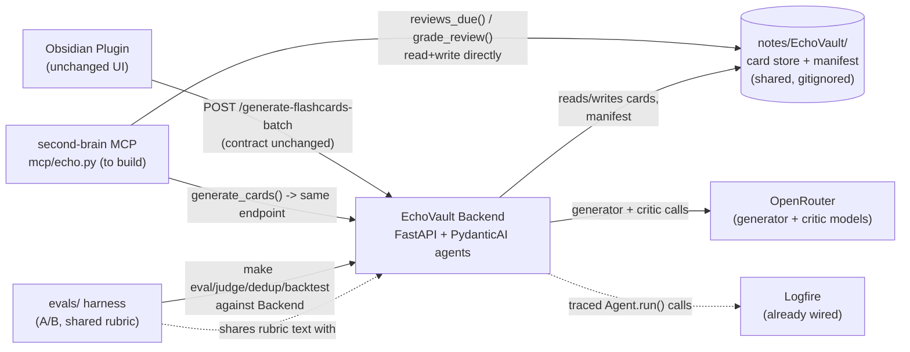
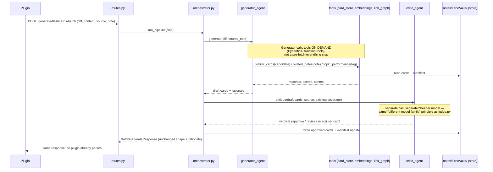

# Agent harness — build design (draft)

**Status: draft, not yet reviewed for implementation.** This is the "how do we
actually build it" companion to the second-brain repo's
`docs/echo-vault-redesign.md` (the why/what) and `ADR-014` (the decision
record). That doc stays the source of truth for principles; this one proposes
concrete modules, call flow, and how it plugs into the rest of the project.

**Grounding fact that shapes everything below:** the backend already runs on
**PydanticAI** — `flashcard_agent = Agent(model, system_prompt=..., output_type=
GenerateResponse)` in `openrouter.py` is today's single-shot extraction call.
Logfire tracing is already wired to it (`logfire.instrument_pydantic_ai()` in
`observability.py`). So this isn't "adopt an agent framework" — it's "turn the
one agent already there into several, with tools."

## 1. System context — how this interfaces with the rest of the project



Nothing here replaces the plugin — it keeps calling the same endpoint and
reading the same store it always has. The new pieces are the second-brain MCP
(a thin client of the identical contract + store) and the backend's internal
upgrade from one agent to a small pipeline.

## 2. Proposed module layout

```
backend/app/
├── agents/                    NEW
│   ├── generator.py           the drafting agent — evolves flashcard_agent
│   ├── critic.py              independent review agent (NEW, separate model)
│   ├── gap_finder.py          proactive weekly pass (NEW — build LAST, see §6)
│   └── orchestrator.py        chains generator -> critic; called by routes.py
│
├── tools/                     NEW — mechanical, @agent.tool-decorated (dumb pipes)
│   ├── card_store.py          read/write notes/EchoVault/ (cards + manifest)
│   ├── embeddings.py          similar_cards() — OpenRouter embeddings + cosine sim
│   └── link_graph.py          related_notes() — markdown links/tags, 1-2 hops
│
├── rubric.md                  NEW — shared quality rubric (see note below)
├── routes.py                  UNCHANGED contract; calls orchestrator internally
├── schemas.py                 unchanged response shape (+ optional rationale field)
├── openrouter.py              model/provider setup — mostly unchanged
└── observability.py           unchanged; already traces Agent.run() via Logfire
```

**On `rubric.md`:** `evals/judge.py`'s rubric (question_clarity, answer_quality,
distractor_quality, groundedness, cognitive_level) is *exactly* what
`critic.py` should also check — one is offline/batch, one is online/per-request,
same criteria. But `evals/` and `backend/` are separate `uv` projects (their
own `pyproject.toml`s) — no Python import between them. Simplest fix: one
shared, language-agnostic rubric file both read (backend at runtime, `judge.py`
at eval time), instead of maintaining the criteria twice and risking drift.

## 3. Sequence — one generation request



The Critic is a **genuinely separate `.run()` call**, not a second pass in the
same context — that's what avoids self-approval bias (the same reason
`EVAL.md` already recommends a different model family for the offline judge;
the runtime critic should follow the same rule).

## 4. Why tools, not pre-fetched context

The redesign doc's step list (survey → contextualize → decide → draft →
critique) could read as an imperative pipeline that fetches everything up
front and stuffs it into one prompt. PydanticAI's `@agent.tool` mechanism is
better than that: `generator_agent` calls `similar_cards()`/`related_notes()`
**itself, mid-reasoning, only when it decides it's relevant** — e.g. checking
for near-duplicates on a concept that feels common, or pulling related notes
only when a card would benefit from a connection. Cheaper (fewer irrelevant
lookups) and more genuinely agentic than static context injection.

## 5. Interfaces, explicitly

- **Obsidian plugin** — `routes.py`'s signature is untouched. Zero plugin changes.
- **second-brain MCP** (`mcp/echo.py`, to build) — `generate_cards()` calls the
  *same* endpoint the plugin uses; `reviews_due()`/`grade_review()` read/write
  the *same* `card_store.py`-managed files. Grading in Obsidian or via a
  second-brain `/review` session updates one shared state, no drift.
- **`evals/` harness** — (a) the A/B infra already built (`old-extraction` vs.
  new pipeline baseline) is the trust gate before shipping this; (b) the shared
  `rubric.md` keeps `judge.py` and `critic.py` from silently diverging.
- **Docker/infra** — the backend is stateless today; it needs read+write access
  to `notes/EchoVault/` (and read access to `knowledge/` for `link_graph.py`) —
  a new mounted volume in `docker-compose.yml`.
- **Config** — a new `CRITIC_MODEL` env var, following `judge.py`'s own
  already-documented principle (different model family than the generator).
- **Logfire** — already instruments `pydantic_ai` calls; a multi-agent handoff
  gets per-step tracing for free, which matters for debugging *why* a card was
  drafted, revised, or rejected.

## 6. Build order (concrete)

1. `tools/card_store.py` + manifest — replaces git-checkpoint diffing
   (plugin-side change too; see the redesign doc §3). Foundation everything
   else reads/writes.
2. `tools/embeddings.py` (`similar_cards`) + `tools/link_graph.py`
   (`related_notes`) — the two retrieval tools, kept separate (they answer
   different questions, see redesign doc §4a).
3. `agents/generator.py` — evolve `flashcard_agent`: attach the tools above,
   richer prompt (question-type taxonomy, depth calibration inputs).
4. `agents/critic.py` + `rubric.md` (shared with `judge.py`) — separate agent,
   separate model.
5. `agents/orchestrator.py` — chain generator → critic, wire into `routes.py`
   (contract unchanged).
6. **Backtest via `evals/`** (old baseline vs. new) before trusting any of this
   — the gate, not a courtesy check.
7. `mcp/echo.py` in second-brain — the thin client.
8. `agents/gap_finder.py` — **last**, per the redesign doc's explicit
   "build after the reactive pipeline is trusted" guidance. Separate cadence
   (weekly), separate concerns (prerequisite/silence/weak-performance gaps).

## 7. Open decisions

- Exact `CRITIC_MODEL` choice — same cost/quality tradeoff `judge.py` already
  documents for `JUDGE_MODEL`.
- Confirm-before-write vs. background-with-digest (still open in the redesign
  doc §11 — leaning digest-only).
- Does `generator_agent` get a `retire_card`/`update_card` tool now, or wait
  until `gap_finder.py` needs it?
- Single orchestrator function vs. PydanticAI's own agent-delegation pattern
  (an agent calling another agent as a tool) — leaning toward the explicit
  two-call orchestrator (§3) since the separation of *calls*, not just
  prompts, is what makes the critic a real check.
